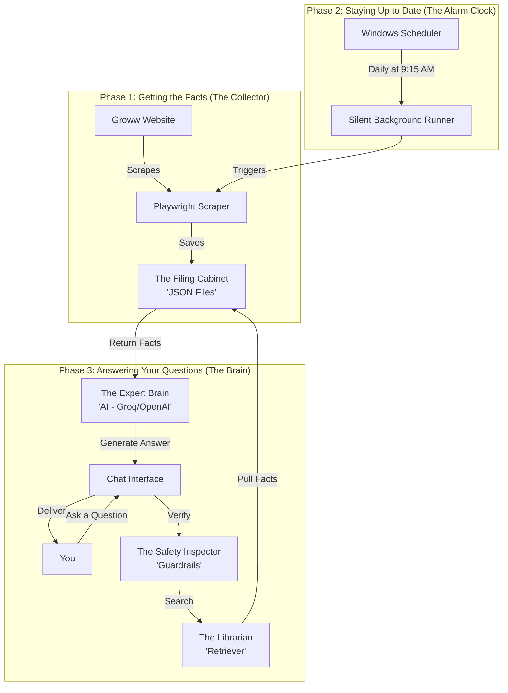

# Mutual Fund FAQ Chatbot — Production RAG Assistant

A facts-only, production-grade RAG-based assistant specialized in **SBI Mutual Fund** schemes. Built with a focus on accuracy, safety, and transparency, this assistant uses a daily automated pipeline to ensure financial data is always current.

## 🚀 Key Features
- **Automated Data Pipeline**: Scrapes live Groww scheme pages daily at 9:15 AM IST via GitHub Actions.
- **Strict Guardrails**: Pre-retrieval intent classifier blocks investment advice, comparisons, and PII.
- **Factual Contextual Answers**: Responses are limited to a maximum of 3 sentences, drawn strictly from authoritative sources.
- **Transparent Citations**: Every response includes a direct source URL and a "Last Updated" timestamp.
- **Premium Web UI**: A modern, glassmorphic dark-mode interface with smooth micro-animations.

## 📁 Project Structure
```
PROJ 4 MUTUAL FUNDS CHATBOT/
├── .github/workflows/      # Phase 2a: GitHub Actions Scheduler (9:15 AM IST)
├── api/                    # Phase 5: FastAPI Backend Bridge
├── chunker/                # Phase 3: Text Processing & ChromaDB Embedding
├── data/                   # Knowledge Base (Scraped JSON & Vector Store)
├── DOCS/                   # Architecture & Requirements Documentation
├── rag_engine/             # Phase 4: Intent Guardrails & RAG Retrieval
├── scheduler/              # Scheduler configuration and guides
├── scraper/                # Phase 2b: Playwright Scraping Service
└── ui/                     # Phase 5: Premium Vanilla HTML/CSS Frontend
```

## 🛠️ Prerequisites
- **Python 3.11+**
- **OpenAI API Key** (Stored in environment variables)
- *Optional for local vector builds*: Microsoft C++ Build Tools (required for local ChromaDB compilation).

## 🏃 Getting Started

### 1. Install Dependencies
```bash
pip install -r scraper/requirements.txt
pip install -r chunker/requirements.txt
pip install -r rag_engine/requirements.txt
pip install -r api/requirements.txt
```

### 2. Configure Environment
```bash
set OPENAI_API_KEY=your_key_here
```

### 3. Run the Scraper (Populate Data)
```bash
python scraper/scraper.py
```

### 4. Launch the Web App
```bash
python api/server.py
```
View the app at: [http://localhost:8000](http://localhost:8000)

## 🏗️ Architecture Detail
- **Embeddings**: `all-MiniLM-L6-v2` (Local via HuggingFace)
- **Vector Store**: `ChromaDB` (Local persistence in `data/chroma/`)
- **LLM Engine**: `gpt-4o-mini` (OpenAI with strict system prompts)
- **Frontend Core**: Vanilla HTML5 / Modern CSS / JS (Inter Font & Phosphor Icons)

## ⚖️ Safety & Disclaimer
This assistant is strictly informational. It is programmed to refuse advisory or comparative queries and provide only dry fund facts (NAV, AUM, Ratios, Exit Loads) as reported by the latest official scrape.

---

## 📖 Simple Guide: How Your Mutual Fund Chatbot Works

This system is designed to be "Set and Forget." Here is how it works from beginning to end:



### 1. The Collector (Scraping)
Every day, a special "Robot" visits the Groww website, reads the latest fund prices, and writes them down into a **Filing Cabinet** (JSON files).

### 2. The Alarm Clock (Scheduling)
An automated **Alarm Clock** (Windows Task Scheduler) wakes up the Collector at **9:15 AM** every morning to get fresh facts.

### 3. The Safety Inspector (Guardrails)
The **Safety Inspector** checks your question first. If you ask for risky financial advice, it politely refuses and provides only facts.

### 4. The Librarian & The Expert Brain
The **Librarian** finds the documents you need, and the **Expert Brain** (AI) explains them to you in plain English.

---
> [!TIP]
> This guide is permanently saved in the [summary process](file:///d:/PROJ%204%20MUTUAL%20FUNDS%20CHATBOT/summary%20process/full_system_flow.md) folder. I will update it automatically if the system architecture changes.
