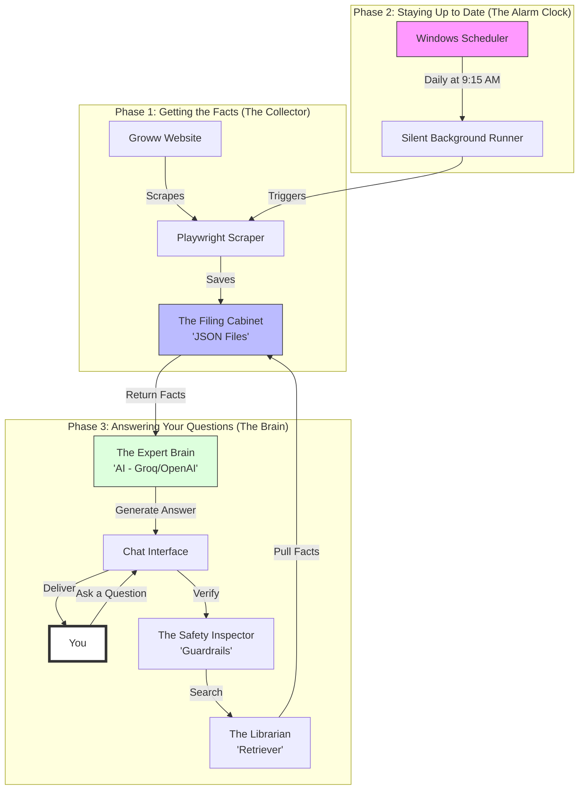

# Simple Guide: How Your Mutual Fund Chatbot Works

This guide explains the entire system from beginning to end in simple terms.

---

### 1. The Collector (Scraping)
Every day, a special "Robot" (Scraper) visits the Groww website. It acts like a digital reader that looks at the mutual fund pages and writes down the current prices (NAV) and other details into a **Filing Cabinet** (the JSON files in your folder).

### 2. The Alarm Clock (Scheduling)
To make sure you don't have to do anything manually, we have a digital **Alarm Clock** (Windows Task Scheduler). At 9:15 AM every morning, it quietly tells the "Collector" to go get the newest facts. This happens in the background, so you never see any pop-ups.

### 3. The Safety Inspector (Guardrails)
When you ask a question, the first person to see it is the **Safety Inspector**. If you ask for investment advice (e.g., "Which fund should I buy?"), the inspector says: *"I'm sorry, I only provide facts, not financial advice."* This keeps the chatbot safe and professional.

### 4. The Librarian (The RAG Engine)
If your question is safe, the **Librarian** goes to the "Filing Cabinet." It finds the specific file for the fund you mentioned and pulls out the exact facts you asked for.

### 5. The Expert Brain (The AI)
The Librarian gives those facts to the **Expert Brain** (advanced AI from Groq or OpenAI). The AI interprets the code and numbers and turns them into a polite, easy-to-read sentence for you.

### 6. The Result
You receive a factual, grounded answer that is updated every single morning automatically!
