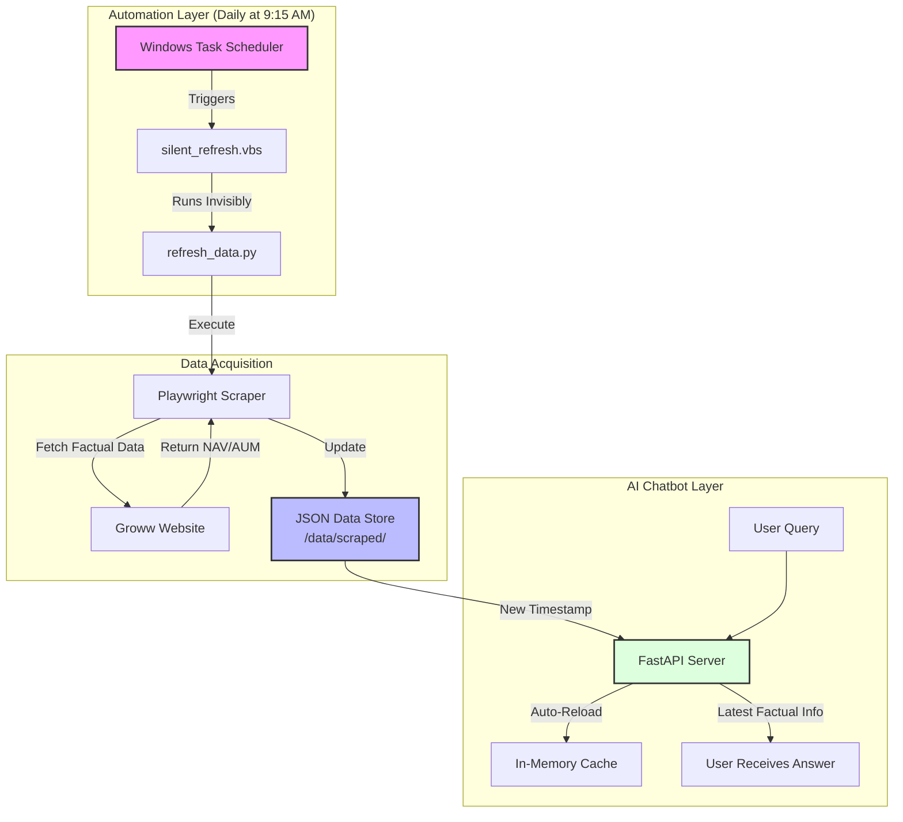

# Mutual Fund Chatbot - Process Flow Summary

This diagram explains how the automated "Set and Forget" update system works.

### Key Components:
1.  **The Trigger**: Windows Task Scheduler starts the process every morning at 9:15 AM.
2.  **The Ghost**: `silent_refresh.vbs` ensures the update happens in the background without disturbing your work.
3.  **The Collector**: `scraper.py` (via Playwright) visits the mutual fund pages and extracts the latest prices.
4.  **The Self-Healer**: Your Chatbot API automatically "notices" the new data and refreshes itself on the fly.
